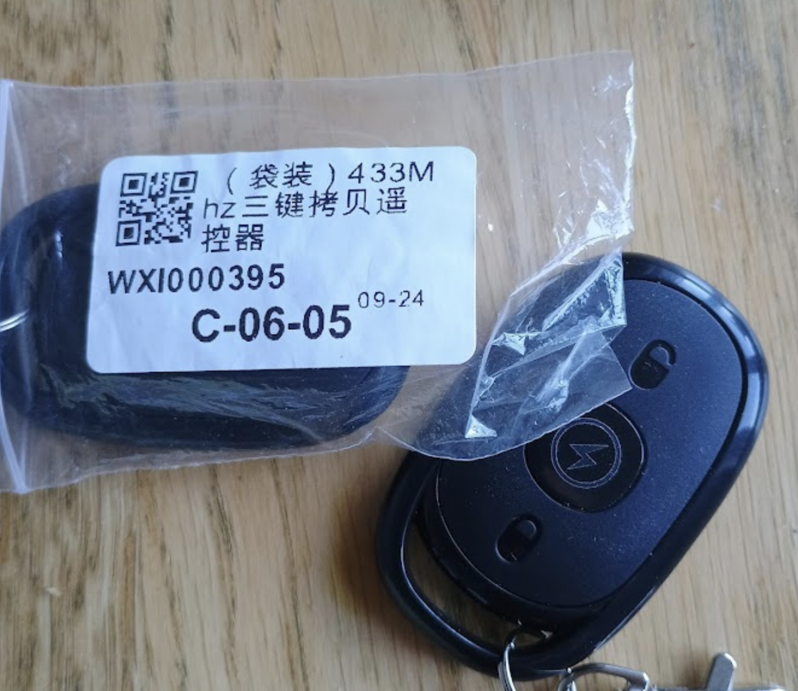

# Setting up AliExpress 433Mhz Fobs in Learn mode.
How to set up AliExpress Learning 433Mhz Fobs

There are 3 buttons on this fob. (see images)

Press the middle key and 'unlock' key together for more than 5 seconds. 
Tap the middle key 3 times (still keep holding the unlock key) - the fob's led blinks for a short duration.

Now select the key (middle, unlock or lock) you want to program and keep that pressed whilst transmitting the source you want to copy.

